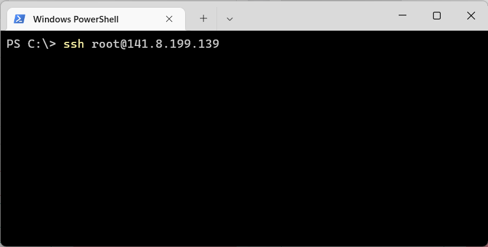

# L.A.P.S. chatGPT telegram бот

ChatGPT telegram бот

```
TODO:
- написать текст вступительного слова о боте по плану:
  - что это
  - кому это надо
- сделать содержание
- вынести в отдельные README:
  - регистрация openai
  - регистрация бота в Телеграм
...
```

## Содержание

[TOC]

## Как зарегистрироваться в OpenAI ChatGPT из России и прочих подсанкционных регионов в 2023 году

### 1. Что нужно сделать перед регистрацией


Если вы уже пробовали зарегистрироваться и остановились на шаге с ошибкой, что в нашей стране регистрация не доступна, то теперь вам нужно почистить куки и кеш в браузере.

Как почистить куки и кеш в Google Chrome:

- Переходим в настройки (кликаем на 3 точки в правом верхнем углу)
- Справа кликаем на «Конфиденциальность и безопасность»
- Удаляем все данные за всё время


Чистим куки и кеш в Google Chrome

Если вы ещё не заходили на сайт OpenAI и не пробовали регистрироваться, то ничего чистить не нужно.

### 2. Используйте VPN для регистрации OpenAI

Включите VPN, подмените местоположение на страну не из санкционного списка. Запомните страну, так как позже нужно будет подтвердить создание аккаунта через прием СМС на одноразовый номер, входящий в зону телефонных номеров этой страны.

### 3. Зарегистрировать аккаунт [gmail](https://gmail.com)

Зарегистрируйте новую почту GMAIL указав ту страну, откуда идет ваш vpn-траффик

### 4. Перейдите на сайт openai.com, начните регистрацию

Нажмите "арегистрироваться", создайте аккаунт используя gmail почту из шага 3


### 4. Перейдите на сайт sms-activate

Зарегистрируйтесь по ссылке: [sms-activate.ru](https://sms-activate.org/?ref=6834896), любым доступным способом. Выберите сервис для активации "ChatGPT" или "openai", выберите номер той страны, откуда идет ваш vpn траффик. Пополните любым удобным способом баланс на требуемую сумму как удобно, оплатите активацию.


Укажите при создании openai аккаунта номер, который вы арендовали в sms-activate


Дождитесь sms, вставьте sms код из окна sms-activate в окно openai, активируйте аккаунт

Перейдите в настройки аккаунта, найдите и скопируйте api_key openai:

1. Перейдите в личный кабинет OpenAI и нажмите на вкладку Personal в правом верхнем углу. В выпадающем списке выберите API keys.
   

2. Нажмите Create new secret key. Появится окно, в котором будет ваш API key. Скопируйте его, он потребуется при установке бота на сервер(инструкции далее по тексту).
   

---

## Регистрация бота в Telegram

1. Зайдите в Telegram
2. Найдите чат [@Bot_father](https://t.me/@Bot_father)
3. Создайте бота и получите api_key telegram
4. Дальнейшие настройки бота (аватар, описание, и т.д.) - по усмотрению, инструкции найдете на месте

### Регистрация бота

Создание любого бота начинается сообщения отцу ботов в телеграме — [@Bot_father](https://t.me/@Bot_father).

Он может управлять всеми существующими ботами, с помощью множества команд. Их список в любой момент можно вызвать командой **/help**


Для создания нового бота отправьте команду **/newbot**. После ответов на пару вопросов бот будет создан, а отец ботов пришлёт токен. Его нужно будет указывать в коде для взаимодействия с BotAPI.

Токен для каждого бота уникален. Нельзя, чтобы он попал в открытый доступ. Однако если это произошло, его всегда можно сменить через ботопапу командой **/revoke**.

Так будет выглядеть диалог создания бота:


Итак, бот зарегистрирован.

---

## Регистрация на хостинге и создание выделенного сервера SprintBOX

Идем по [ссылке на проверенный сервис VDS c промокодом на скидку или бонус](https://sprintbox.ru/promo/V74QI-42N9K-3H9SO) и регистрируемся, например, через тот же **gmail**:


```
TODO:
- Дополнить мануал:
  - создание бокса пошагово
  - добавить скриншоты поэтапно
...
```

## Настройка выделенного сервера SprintBOX

Теперь, когда наш бокс создан, необходимо к нему удаленно подключиться через терминал или командную строку - в зависимости от вашей операционной системы.

### 1. Установите подключение по SSH

**_SSH_** — защищенный сетевой протокол. Он позволяет установить соединение по зашифрованному туннелю и управлять удаленным сервером. Для боксов с чистыми ОС — это основной способ взаимодействия с ними.

Для соединения с VDS используйте:

логин — root
пароль пользователя root, который пришел на почту в момент создания бокса
IP-адрес бокса — он тоже есть в письме, а еще можно посмотреть его в блоке управления боксом.

В современных ОС для подключения по SSH есть встроенные инструменты: в Linux и MacOS — программа «Терминал», в Windows — PowerShell.

Откройте программу и введите в адресную строку: ssh root@IP-адрес



При первом подключении к серверу программа предупредит, что к этому хосту она еще не подключалась и попросит добавить его в список доверенных. Введите yes и нажмите Enter.


Дальше программа попросит пароль — он в письме, отправленном вам при создании бокса. Пароль можно скопировать и вставить или ввести вручную — символы отображаться не будут, даже замаскированными, так системы обеспечивают безопасность пароля.


При первом подключении система попросит изменить пароль. Сначала введите текущий — можно не вручную, а вставить его из буфера обмена. Символы по-прежнему не будут отображаться:


Дальше система попросит придумать новый пароль:


И повторить его:


Готово! Теперь можно работать с боксом:


При следующих подключениях будет достаточно ввести команду ssh root@IP-адрес, а затем пароль. Подтверждать добавление хоста в список доверенных и менять пароль уже не нужно.

### 2. Клонируйте репозиторий проекта и сделайте install.sh исполняемым

Введите последовательно указанные ниже команды:

2.1. Клонируем репозиторий с проектом

```bash
git clone https://github.com/laps78/laps-gpt-install
```

2.2. Разрешаем исполнение инсталлятора (install.sh)

```bash
sudo chmod +x laps-gpt-install/install.sh
```

2.3. Запускаем инсталлятор (install.sh)

```bash
./laps-gpt-install/install.sh
```

Вы увидите начало процесса установки програмного обеспечения на удаленном сервере. Будут установлены обновления сборки серверного ПО и некоторые дополнительные пакеты, требуемые для работы приложения.

В процессе установки потребуестя ввести вручную или скопировать/вставить некоторые дополнительные данные. Читайте, что пишет инсталлятор дайте ему то, что он хочет.

ПРИМЕРЫ СООБЩЕНИЙ ИНСТАЛЛЯТОРА:

```
  ============================================================
  || СОЗДАНИЕ ПОЛЬЗОВАТЕЛЯ НА СЕРВЕРЕ      <<< L.A.P.S. Lab ||
  ||--------------------------------------------------------||
  || Будет создан пользователь gpt_bot. Вам будет предложено||
  || ввести и подтвердить UNIX пароль, а также заполнить    ||
  || дополнительную информацию о пользователе. Обязательно  ||
  || требуется точно ввести и повторить пароль, остальные   ||
  || данные можно не указывать - просто нажимайте [enter].  ||
  ============================================================
```

Далее инсталлятор предложит придумать пароль, повторить его ещё раз и заполнить информацию о новом пользователе. Все поля, кроме пароля, не обязательны, можно жать Enter для подстановки значения по умолчанию. При вводе паролей символы не будут отображаться - это нормально. Копипаста также сработает.

Далее потребуется установить значения api-токенов для работы с сервисами openai и Telegram:

```
  ============================================================
  || ПОДКЛЮЧЕНИЕ К API OPENAI              <<< L.A.P.S. Lab ||
  ||--------------------------------------------------------||
  ||                                 _____                  ||
  || ________________________________ ___{_}                ||
  || _  __ \__  __ \  _ \_  __ \  __  /_  /                 ||
  || / /_/ /_  /_/ /  __/  / / / /_/ /_  /                  ||
  || \____/_  .___/\___//_/ /_/\__,_/ /_/                   ||
  ||       /_/                                              ||
  ||********************************************************||
  || Введите токен, полученный на сайте openai.com:         ||
  ============================================================
```

Введите api-токен openai. Как получить api-токен openai указано выше.

```
  ============================================================
  || ПОДКЛЮЧЕНИЕ К API TELEGRAM            <<< L.A.P.S. Lab ||
  ||--------------------------------------------------------||
  ||  _____     ______                                      ||
  ||  __  /________  /___________ _____________ _______ ___ ||
  || _  __/  _ \_  /_  _ \_  __  /_  ___/  __  /_  __  __ \ ||
  || / /_ /  __/  / /  __/  /_/ /_  /   / /_/ /_  / / / / / ||
  || \__/ \___//_/  \___/_\__, / /_/    \__,_/ /_/ /_/ /_/  ||
  ||                     /____/                             ||
  ||********************************************************||
  || Введите токен, полученный в Telegram от @botFather:    ||
  ============================================================
```

Введите api-токен бота telegram, который выдал @botFather при создании бота в Телеграм.

```
TODO:
- вставить вывод окончания установки
- вставить дальнейшие инструкции
...
```
